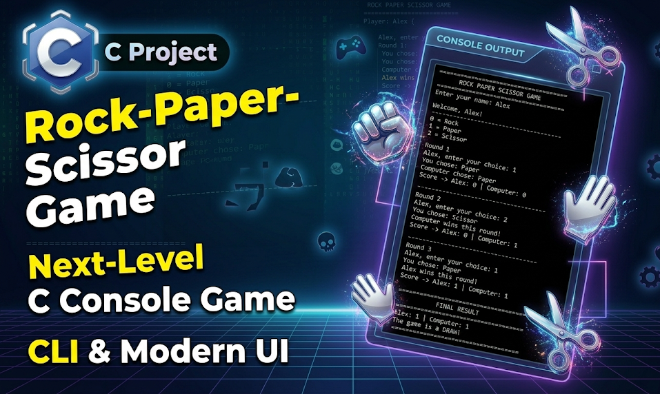

# 🎮 Rock Paper Scissors (C)

A simple and interactive **Rock Paper Scissors game** built in C.

Play against the computer in a 3-round match with a clean command-line interface.

---


## 📸 Preview


---

## 🚀 Features

* 🧠 Computer generates random moves
* 🎯 Input validation (no crashes on wrong input)
* 📊 Score tracking system
* 🔁 Multiple rounds (Best of 3)
* 💡 Clean and readable code structure

---

## 🛠️ Tech Stack

* Language: **C**
* Libraries Used:

  * `stdio.h`
  * `stdlib.h`
  * `time.h`

---

## 📦 How to Run

### 1. Clone the Repository

```bash
git clone https://github.com/ahmedfakhar747/Rock-Paper-Scissors.git
cd Rock-Paper-Scissors
```

### 2. Compile the Program

```bash
gcc program.c -o game
```

### 3. Run the Game

```bash
./game
```

---

## 🎮 How to Play

* Enter your name
* Choose:

  * `0` → Rock
  * `1` → Paper
  * `2` → Scissor
* Play 3 rounds against the computer
* Final winner is decided based on score

---

## 🧠 Game Logic

* Rock beats Scissor
* Scissor beats Paper
* Paper beats Rock
* Same choices = Draw

---

## 🤝 Contributing

Contributions are welcome!
Feel free to fork this repo and submit a pull request.

---

## 📄 License

This project is licensed under the **MIT License**.

---

## ⭐ Support

If you like this project, give it a ⭐ on GitHub!

---
